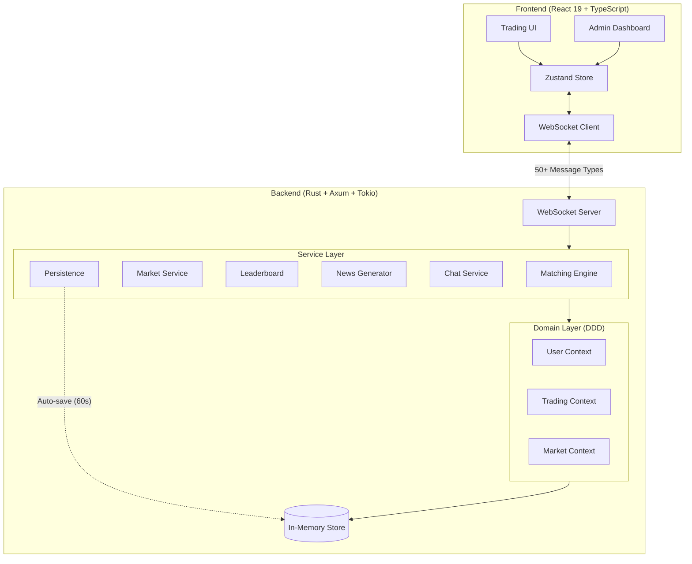

<div align="center">

# StockMart

### Real-time Stock Trading Game & Simulation Platform

**Trade. Compete. Learn. Dominate the leaderboard!**

[](./backend/tests)
[](./frontend/tests)
[](#testing)
[](#testing)

[](#features)
[](#features)
[](#features)

[](https://www.rust-lang.org/)
[](https://react.dev/)
[](https://www.typescriptlang.org/)
[](https://tokio.rs/)
[](#features)

[](./LICENSE)
[](./docs/CONTRIBUTING.md)
[](#)

<br />


*A professional trading desk with real-time charts, order book, portfolio tracking, and live leaderboard*

**Start with $100,000 virtual cash. Outsmart other traders. Climb the rankings!**

</div>

---

## Table of Contents

- [Why StockMart?](#why-stockmart)
- [Quick Start](#quick-start)
- [Game Modes](#game-modes)
- [Features](#features)
  - [Trading Desk](#trading-desk)
  - [Admin Dashboard](#admin-dashboard)
- [Architecture](#architecture)
- [Use Cases](#use-cases)
- [Educational Value](#educational-value)
- [Testing](#testing)
- [Extensibility](#extensibility)
- [Roadmap](#roadmap)
- [Contributing](#contributing)
- [License](#license)

---

## Why StockMart?

StockMart is a **multiplayer stock trading game** that combines the thrill of competitive gaming with real-world trading mechanics. Whether you're a gamer looking for a unique challenge or a student learning finance, StockMart delivers:

- **Competitive Multiplayer**: Trade against friends, classmates, or strangers in real-time
- **Live Leaderboards**: Watch your ranking rise as you outsmart the competition
- **Risk-Free Thrills**: Experience market highs and lows without losing real money
- **Game Master Controls**: Admins can run timed competitions, trading challenges, and tournaments
- **Real Market Mechanics**: Learn actual trading strategies that work in real markets
- **Instant Action**: WebSocket-powered updates—see trades execute in milliseconds

---

## Quick Start

### Prerequisites

| Requirement | Version | Download |
|-------------|---------|----------|
| **Rust** | 1.76+ | [rustup.rs](https://rustup.rs/) |
| **Node.js** | 18+ | [nodejs.org](https://nodejs.org/) |

### Start Trading in 60 Seconds

```bash
# Clone the repository
git clone https://github.com/yourusername/stockmart.git
cd stockmart

# Start the backend (Terminal 1)
cd backend
RUST_LOG=info cargo run

# Start the frontend (Terminal 2)
cd frontend
npm install && npm run dev
```

Open [http://localhost:5174](http://localhost:5174), register an account, and start trading!

> **For detailed setup instructions**, see [docs/SETUP.md](./docs/SETUP.md)

---

## Game Modes

| Mode | Description | Best For |
|------|-------------|----------|
| **Free Play** | Trade anytime, build your portfolio at your own pace | Learning basics, casual play |
| **Speed Trading** | 15-30 minute intense trading sessions | Quick competitions, lunch breaks |
| **Tournament** | Multi-round elimination with rising stakes | Serious competitions, prizes |
| **Paper Trading** | Practice strategies without affecting leaderboard | Strategy testing, learning |
| **Team Battle** | Groups compete for highest combined net worth | Classroom activities, team building |

### How Competitions Work

1. **Admin initializes** game with equal starting cash for all players
2. **Market opens** and trading begins
3. **Players compete** to maximize net worth through smart trades
4. **Leaderboard updates** in real-time showing rankings
5. **Market closes** and winners are crowned!

---

## Features

### Trading Desk

The trader interface provides everything needed for a realistic trading experience:

<div align="center">

</div>

| Feature | Description |
|---------|-------------|
| **Real-time Charts** | Professional candlestick charts powered by TradingView's Lightweight Charts |
| **Order Types** | Market orders (IOC) and Limit orders (GTC/IOC) |
| **Order Sides** | Buy, Sell, and Short selling with 150% margin requirement |
| **Order Book** | Live bid/ask depth with spread calculation |
| **Portfolio Tracking** | Real-time P&L, holdings value, and net worth |
| **Leaderboard** | Live rankings based on total net worth |
| **Global Chat** | Real-time communication between traders |
| **News Feed** | Simulated market news with sentiment indicators |
| **Market Indices** | Sector-based indices with live updates |

#### Symbol Selector

<div align="center">

</div>

*Quickly switch between stocks with the searchable symbol dropdown*

---

### Admin Dashboard

Educators and game masters have complete control over the trading environment:

<div align="center">

</div>

| Feature | Description |
|---------|-------------|
| **Market Control** | Open/close trading with a single click |
| **Game Initialization** | Reset all portfolios with configurable starting capital |
| **Trader Management** | View all traders, mute chat, or ban users |
| **Company Management** | Create new stocks (IPOs), set volatility, mark bankrupt |
| **Circuit Breakers** | Configure automatic trading halts for volatility |
| **Real-time Monitoring** | Live stats, recent trades, and system health |

#### Game Control Panel

<div align="center">

</div>

*Configure trading hours, circuit breakers, and initialize new game sessions*

#### Trader Management

<div align="center">

</div>

*Monitor all traders with net worth, rankings, and moderation controls*

#### Company Management

<div align="center">

</div>

*Manage listed companies, adjust volatility, and monitor trading activity*

---

## Architecture

StockMart follows **Domain-Driven Design (DDD)** principles with a clean separation between backend and frontend:



### Technology Stack

| Layer | Technology | Purpose |
|-------|------------|---------|
| **Backend Runtime** | Rust + Tokio | High-performance async runtime |
| **Web Framework** | Axum | Fast, ergonomic HTTP/WebSocket server |
| **Concurrency** | DashMap | Lock-free concurrent data structures |
| **Frontend Framework** | React 19 | Modern UI with concurrent features |
| **State Management** | Zustand | Lightweight, hooks-based state |
| **Styling** | TailwindCSS 4 | Utility-first CSS framework |
| **Charts** | Lightweight Charts | Professional financial charting |
| **E2E Testing** | Playwright | Cross-browser automated testing |

### Key Architectural Decisions

1. **WebSocket-First**: All real-time data flows through WebSocket with 50+ typed message types
2. **In-Memory Speed**: DashMap provides lock-free concurrent access for thousands of users
3. **Price-Time Priority**: Matching engine uses industry-standard order matching algorithm
4. **Auto-Persistence**: Data saved to JSON every 60 seconds with graceful shutdown
5. **Repository Pattern**: Easy to swap in-memory store for PostgreSQL in production

> **For detailed architecture documentation**, see [docs/ARCHITECTURE.md](./docs/ARCHITECTURE.md)

---

## Use Cases

StockMart is designed for multiple audiences:

### For Gamers

| Use Case | Description |
|----------|-------------|
| **Competitive Trading** | Battle friends in real-time trading competitions |
| **Leaderboard Climbing** | Grind your way to the top of the rankings |
| **Strategy Gaming** | Use market analysis skills to outplay opponents |
| **Speed Challenges** | Quick 15-minute trading blitzes |
| **Risk-Free Betting** | Experience the thrill of trading without real losses |

### For Schools & Colleges

| Use Case | Description |
|----------|-------------|
| **Finance Courses** | Teach stock trading, portfolio management, and market dynamics |
| **Economics Labs** | Demonstrate supply/demand, price discovery, and market efficiency |
| **Trading Competitions** | Host class or inter-college trading challenges with leaderboards |
| **Capstone Projects** | Students can extend the platform with new features |

### For Learning Traders

| Use Case | Description |
|----------|-------------|
| **Risk-Free Practice** | Learn order types without risking real money |
| **Strategy Testing** | Experiment with different trading strategies |
| **Market Psychology** | Experience FOMO, fear, and greed in a safe environment |
| **Technical Analysis** | Practice reading candlestick charts and order books |

### For Engineers

| Use Case | Description |
|----------|-------------|
| **Learn Rust** | Production-grade async Rust with Tokio |
| **WebSocket Systems** | Build real-time applications with proper state management |
| **Domain-Driven Design** | Study bounded contexts and aggregate roots in practice |
| **Testing Patterns** | 599+ tests demonstrating unit, integration, and E2E patterns |

### For Product Managers

| Use Case | Description |
|----------|-------------|
| **Trading Platform UX** | Understand trading platform workflows |
| **Feature Simulation** | Prototype trading features before building |
| **Stakeholder Demos** | Demonstrate trading concepts to non-technical audiences |

---

## Educational Value

### What Students Learn

```
Trading Fundamentals          Technical Skills
├── Order Types               ├── Rust Programming
│   ├── Market Orders         ├── React/TypeScript
│   ├── Limit Orders          ├── WebSocket Protocol
│   └── Time-in-Force         ├── State Management
├── Trading Mechanics         ├── Testing (Unit/E2E)
│   ├── Bid/Ask Spread        └── Domain-Driven Design
│   ├── Order Book Depth
│   └── Price-Time Priority
├── Risk Management
│   ├── Portfolio Tracking
│   ├── Short Selling
│   └── Margin Requirements
└── Market Dynamics
    ├── Volatility
    ├── Circuit Breakers
    └── Market Indices
```

### Sample Lab Exercises

1. **Order Types Lab**: Place market and limit orders, observe execution differences
2. **Short Selling Lab**: Short a stock, understand margin requirements and risks
3. **Portfolio Lab**: Build a diversified portfolio, track P&L over time
4. **Market Making Lab**: Place bid/ask orders, learn about spread and liquidity
5. **Competition Lab**: 30-minute trading challenge with class leaderboard

---

## Testing

StockMart has comprehensive test coverage across backend and frontend:

### Backend Tests (Rust)

```
backend/tests/
├── auth_tests.rs           # Authentication & sessions
├── trading_tests.rs        # Order placement & matching
├── admin_tests.rs          # Admin operations
├── broadcast_tests.rs      # WebSocket broadcasting
├── concurrency_tests.rs    # Race conditions & thread safety
├── persistence_tests.rs    # Data saving & loading
├── security_tests.rs       # Input validation & auth
├── edge_case_tests.rs      # Boundary conditions
├── state_machine_tests.rs  # Order state transitions
├── validation_tests.rs     # Business rule validation
└── ... (16 test files total)
```

| Metric | Count |
|--------|-------|
| **Test Files** | 16 |
| **Test Cases** | 463 |
| **Lines of Test Code** | 13,444 |
| **Domain Coverage** | ~90% |
| **Service Coverage** | ~85% |
| **Overall Coverage** | ~85% |

```bash
# Run backend tests
cd backend
cargo test

# Run with output
cargo test -- --nocapture

# Run with coverage (requires cargo-tarpaulin)
cargo tarpaulin --out Html
```

### Frontend E2E Tests (Playwright)

```
frontend/tests/e2e/
├── auth/
│   ├── login.spec.ts
│   └── register.spec.ts
├── trading/
│   ├── order-placement.spec.ts
│   ├── portfolio.spec.ts
│   └── multi-user-trading.spec.ts
├── admin/
│   ├── dashboard.spec.ts
│   └── game-control.spec.ts
└── sync/
    └── state-sync.spec.ts
```

| Metric | Count |
|--------|-------|
| **Test Files** | 6 suites |
| **Test Cases** | 136 |
| **Lines of Test Code** | 3,604 |
| **Auth Flow Coverage** | 100% |
| **Trading Flow Coverage** | 95% |
| **Admin Flow Coverage** | 90% |

```bash
# Run E2E tests
cd frontend
npm test

# Run with UI
npm run test:ui

# Run specific suite
npm run test:trading
npm run test:admin
npm run test:auth
```

---

## Extensibility

StockMart is designed to be extended:

### Adding New Order Types

```rust
// backend/src/domain/trading/order.rs
pub enum OrderType {
    Market,
    Limit,
    // Add your new order type
    StopLoss { trigger_price: Price },
    TrailingStop { trail_percent: u8 },
}
```

### Adding Custom Indicators

```typescript
// frontend/src/features/trader/components/Chart.tsx
// Add technical indicators using Lightweight Charts API
chart.addLineSeries({
    color: '#2962FF',
    lineWidth: 2,
}).setData(calculateSMA(candles, 20));
```

### Building Trading Bots

```rust
// Use the WebSocket API to build algorithmic trading bots
// Connect to ws://localhost:3000/ws
// Send: { "type": "PlaceOrder", "symbol": "AAPL", ... }
// Receive: { "type": "OrderAck", ... }
```

### API Integration Points

| Endpoint | Purpose |
|----------|---------|
| `ws://localhost:3000/ws` | WebSocket for real-time trading |
| Messages: `PlaceOrder`, `CancelOrder` | Order management |
| Messages: `Subscribe`, `GetDepth` | Market data |
| Messages: `Chat`, `GetPortfolio` | User features |

---

## Roadmap

### Planned Features

| Feature | Status | Description |
|---------|--------|-------------|
| **PostgreSQL Persistence** | Planned | Replace JSON with proper database |
| **Options Trading** | Planned | Calls, puts, and options strategies |
| **Mobile App** | Planned | React Native trading app |
| **AI Trading Bots** | Planned | NPC traders for single-player practice |
| **REST API** | Planned | HTTP endpoints for integrations |
| **Historical Data** | Planned | Import real market data for backtesting |
| **Advanced Charts** | Planned | More technical indicators and drawing tools |

### Contributing Ideas

We welcome contributions! See [docs/CONTRIBUTING.md](./docs/CONTRIBUTING.md) for guidelines.

---

## Authentication

<div align="center">
<table>
<tr>
<td></td>
<td></td>
</tr>
<tr>
<td align="center"><em>Login Page</em></td>
<td align="center"><em>Registration Page</em></td>
</tr>
</table>
</div>

---

## Contributing

We love contributions! Whether it's:

- Reporting bugs
- Suggesting features
- Improving documentation
- Submitting pull requests

See [docs/CONTRIBUTING.md](./docs/CONTRIBUTING.md) for detailed guidelines.

### Quick Contribution Steps

1. Fork the repository
2. Create a feature branch (`git checkout -b feature/amazing-feature`)
3. Make your changes with tests
4. Commit (`git commit -m 'Add amazing feature'`)
5. Push (`git push origin feature/amazing-feature`)
6. Open a Pull Request

---

## License

This project is licensed under the Apache License 2.0 - see the [LICENSE](LICENSE) file for details.

---

<div align="center">

**Built with love for educators, students, and trading enthusiasts**

[Report Bug](https://github.com/yourusername/stockmart/issues) · [Request Feature](https://github.com/yourusername/stockmart/issues) · [Documentation](./docs/)

</div>
